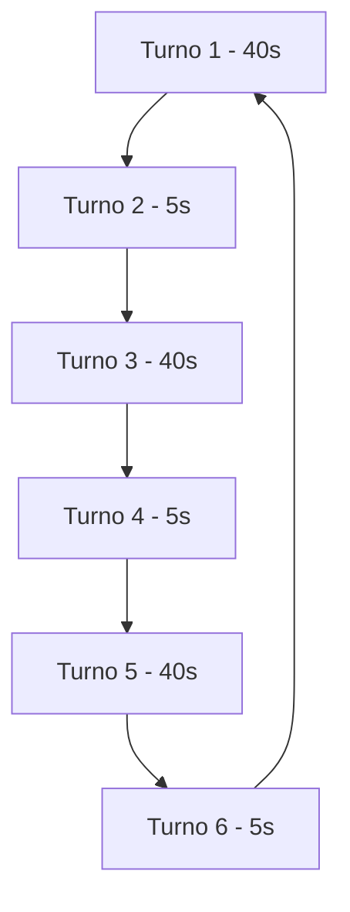

# 🚦 Módulo de Semaforos - Sistema de Control de Tráfico


## 📋 Descripción del Proyecto

Este proyecto implementa un **sistema de semáforos sincronizados** para una vialidad compleja, simulando el comportamiento real de semáforos urbanos. Desarrollado en **lenguaje ensamblador AVR** para el microcontrolador ATmega168P, el sistema controla múltiples semáforos con temporizaciones precisas y secuencias programadas.

## 🎯 Características Principales

### 🔄 Secuencia de 6 Turnos Sincronizados
- **Turnos largos**: 40 segundos (Turnos 1, 3, 5)
- **Turnos cortos**: 5 segundos (Turnos 2, 4, 6)
- **Ciclo total**: 135 segundos
- **Transiciones automáticas** entre turnos

### 💡 Control de LEDs por Puerto
- **Puerto B**: Control de semáforos PB0-PB3
- **Puerto C**: Control de semáforos PC0-PC2  
- **Puerto D**: Control de semáforos PD0-PD2

### ✨ Efectos Especiales
- **Parpadeos sincronizados** en transiciones
- **Estados predefinidos** para cada turno
- **Apagado completo** entre cambios de turno

## 🛠️ Especificaciones Técnicas

### Hardware
- **Microcontrolador**: ATmega168P
- **Frecuencia**: 16MHz
- **Puertos**: B, C, D configurados como salidas
- **Entorno**: Proteus 8.13 para simulación

### Software
- **Lenguaje**: Ensamblador AVR
- **Ensamblador**: AVR Release 8.3SP0
- **IDE Compatible**: Atmel Studio

## 📊 Diagrama de Secuencia



## 🚥 Configuración de Turnos

### Turno 1 (40 segundos)
- **PD0**: ON 🔴
- **PC2**: ON 🟢  
- **PB2**: ON 🟢
- **PB3**: PARPADEO ⚡

### Turno 2 (5 segundos)
- **PD0**: ON 🔴
- **PC2**: ON 🟢
- **PB1**: PARPADEO ⚡

### Turno 3 (40 segundos)
- **PD0**: ON 🔴
- **PC0**: ON 🟢
- **PB0**: ON 🟢

### Turno 4 (5 segundos)
- **PD0**: ON 🔴
- **PB0**: ON 🟢
- **PC1**: PARPADEO ⚡

### Turno 5 (40 segundos)
- **PD2**: ON 🟢
- **PC2**: ON 🟢
- **PB0**: ON 🟢

### Turno 6 (5 segundos)
- **PC2**: ON 🟢
- **PB0**: ON 🟢
- **PD1**: PARPADEO ⚡

## ⚙️ Instalación y Configuración

### Requisitos
- Proteus 8.13 o superior
- AVR Studio o compatible
- Microcontrolador ATmega168P

### Compilación
```bash
# Ensamblar el código
avra proyecto_semaforos.asm

# Generar archivo HEX
avr-objcopy -O ihex proyecto_semaforos.elf proyecto_semaforos.hex
```

### Simulación en Proteus
1. Abrir el archivo `.pdsprj` en Proteus
2. Cargar el archivo `.hex` en el microcontrolador
3. Ejecutar la simulación
4. Observar la secuencia de semáforos

## 🔧 Estructura del Código

### Rutinas Principales
- `RESET`: Configuración inicial de puertos
- `DELAY_1S`: Rutina de delay de 1 segundo
- `DELAY_01S`: Rutina de delay de 0.1 segundos
- `DELAY_MULTIPLE`: Rutina de delay múltiple
- `RETARDO_LOOP`: Loop de retardos en segundos

### Máquina de Estados
Cada turno implementa:
- `INICIAR_TURNO_X`: Configura estados iniciales
- Ejecución con delays precisos
- `TERMINAR_TURNO_X`: Apagado completo y transición

## 🎮 Personalización

### Modificación de Tiempos
```assembly
; Ejemplo: Cambiar Turno 1 a 60 segundos
ldi r17, 300  ; 300 ciclos de 0.2s = 60 segundos
```

### Agregar Nuevos Turnos
Seguir la estructura:
```assembly
INICIAR_TURNO_X:
    ; Configurar puertos
    ; Ejecutar secuencia
TERMINAR_TURNO_X:
    ; Apagar todo
    ; Cambiar al siguiente turno
```

## 🐛 Solución de Problemas

### Error: "Invalid opcode 0xFFFF"
**Causa**: Rutinas de delay ubicadas incorrectamente
**Solución**: Colocar rutinas de delay al inicio del código

### Tiempos Incorrectos
**Causa**: Delays no calibrados para 16MHz
**Solución**: Ajustar valores en `DELAY_1S` y `DELAY_01S`

## 📈 Aplicaciones

- 🏙️ Simulación de tráfico urbano
- 🎓 Enseñanza de sistemas embebidos
- 🔧 Pruebas de sincronización de semáforos
- 💡 Desarrollo de algoritmos de control de tráfico

## 🤝 Contribuciones

Las contribuciones son bienvenidas. Areas de mejora:
- Implementación con interrupciones
- Modos especiales (nocturno, emergencia)
- Control remoto vía UART
- Sensores de tráfico integrados

## 📄 Licencia

Este proyecto es de código abierto para fines educativos.

---

## 👨‍💻 Autor

Desarrollado como ejercicio educativo en **lenguaje ensamblador AVR** para el curso de sistemas embebidos.

**💡 ¿Problemas o sugerencias?** ¡Abre un issue o contribuye al proyecto!

---
*¡Que los semáforos siempre estén a tu favor! 🚦*
